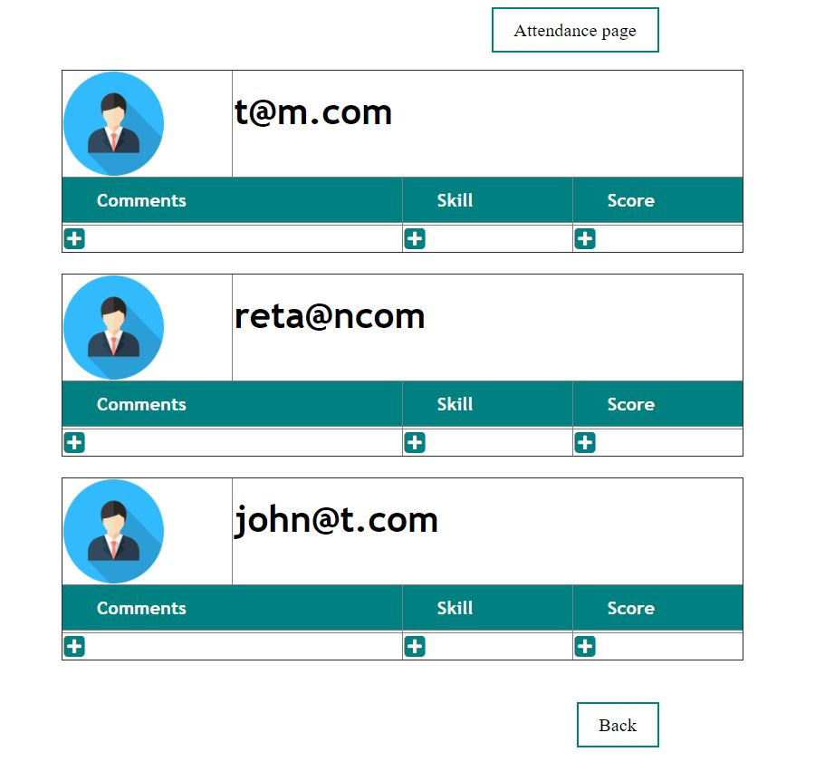
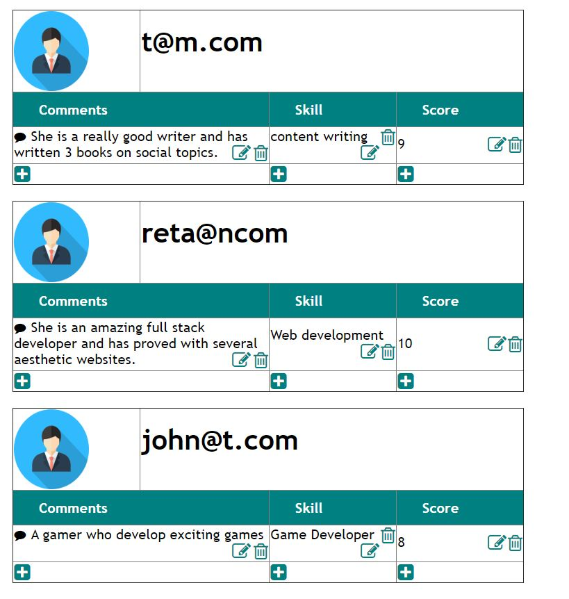
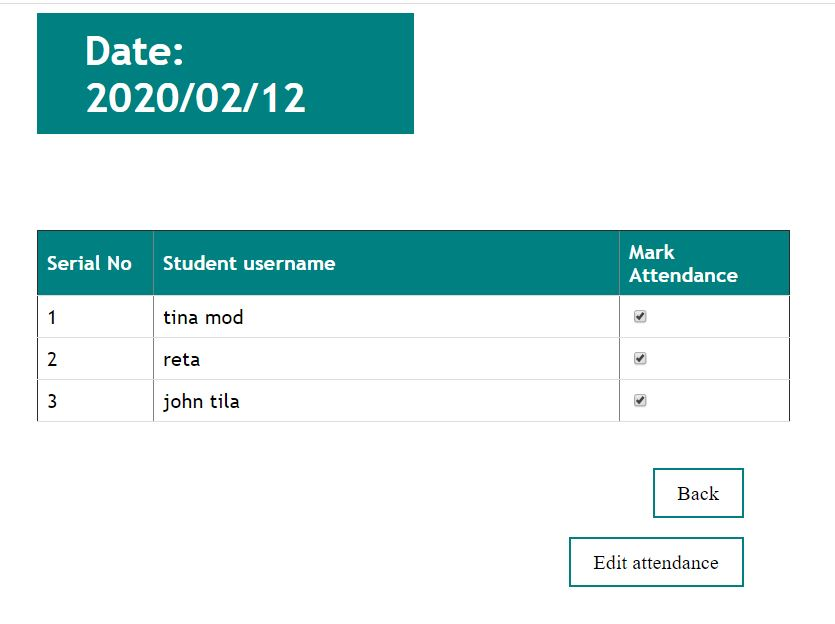
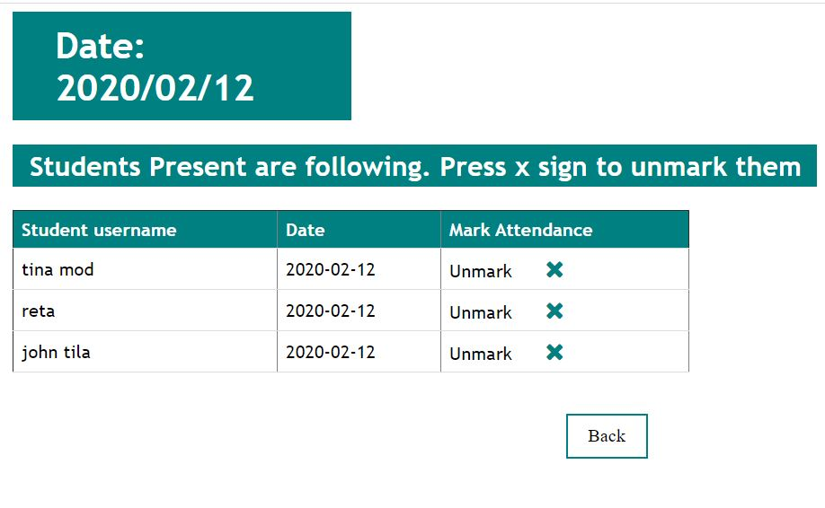
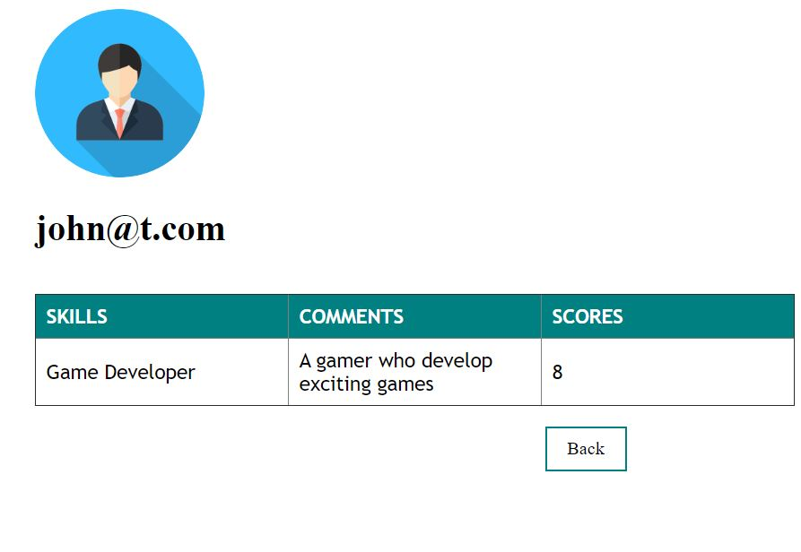

# CMS-for-schools
Content Management System built in PHP and JavaScript for schools and educational institutions 

# Getting Started
Run wamp server and clone the repository to "www" directory of wamp. Enter the link "localhost\signup.php" in your broswer and start exploring the website.

# Pre requisities
Wamp server

# Built With
<ul>
<li>PHP</li>
<li>SQL</li><li>HTML</li>
<li>CSS</li>
<li>JS</li>  
</ul>

# Website Pages

<table>
<tr>

<td></td>
<td>Home Page View for Teachers. Only those students who are enrolled by teacher are shown on that teacher's page. </td>
</tr>
<tr>

<td>Used icons to enter students' Data. Added data can be updated and deleted by using the icons given right next to comments</td>
<td></td>
</tr>
</table>
  
<table>
<tr>

<td>Mark the attendance of students</td>
<td>Edit the marked attendance </td>
</tr>
<tr>
<td></td>
<td></td>

</tr>

</table>
  
<table>
<tr>
<td></td>
<td width="500">Student Page View</td>

</tr>

</table>
